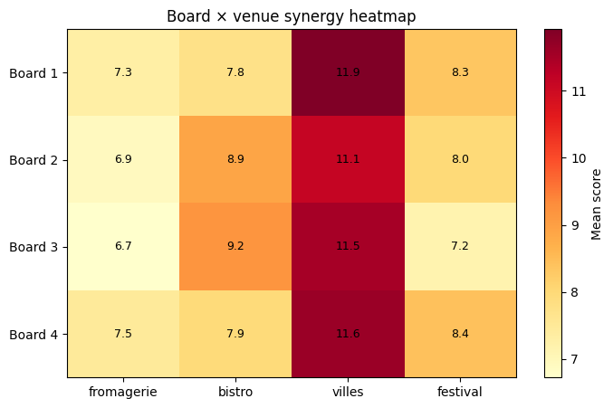
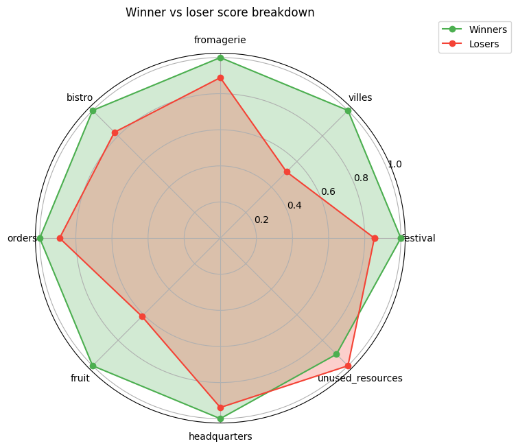
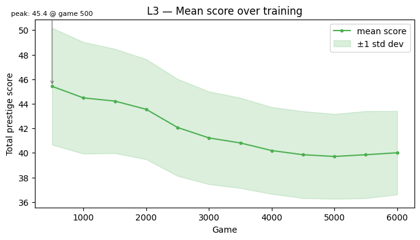

# Fromage

A reinforcement learning agent that learns to play **Fromage** — a 4-player cheese-making strategy board game — using Q-learning with self-play.

## Overview

Players compete across four venues (Fromagerie, Bistro, Villes, Festival) by placing cheese tokens, fulfilling orders, and managing resources. The AI agent learns entirely through self-play against copies of itself, using a linear Q-function over a 292-dimensional state encoding. No deep learning frameworks are used — just numpy. Included is a hyperparameter sweep function to automatically determine the best training parameters. The system also takes advantage of multi-threading for quick training.

## Headline Results

Make sure you have enough fruit to place gold cheese in Villes, then use less aged cheese elsewhere so you can dominate the villes when it comes around. Livestock are also useful to grab important bonuses. Don't worry about using structures much.

<p align="center">
  
  &nbsp;&nbsp;
  
  &nbsp;&nbsp;
  
</p>

### How it works

- **State encoder** converts the full game state (board positions, scores, resources, opponents) into a 292-feature vector
- **Q-learning** with epsilon-greedy exploration trains weights via TD(0) updates
- **Reward shaping** uses score deltas between turns to provide intermediate learning signal
- **Evaluation** pits the trained agent against 3 random opponents to measure win rate

## Setup

```bash
pip install -r requirements.txt
```

Requires Python 3.10+.

## Usage

### Train an agent

```bash
python -m src.train --games 8000 --charts --eval-games 200 --out output/ --learning-plots
```

This trains for 8000 self-play games, evaluates against random agents, and saves charts to `output/`.

Key flags:
- `--games N` — number of training games (default: 8000)
- `--charts` — generate analysis plots
- `--eval-games N` — number of evaluation games against random opponents
- `--learning-plots` — generate training curves (epsilon, scores over time)
- `--out DIR` — output directory for plots and logs

The trained model is saved to `models/trained_agent.npz`.

### Evaluate a saved model

```bash
python -m src.train --model models/trained_agent.npz --eval-games 500 --charts
```

### Run baseline analysis (random vs random)

```bash
python -m src.analyze --games 500 --charts --out output/
```

### Run hyperparameter sweep

```bash
python -m src.sweep
```

Sweep configuration is in `config/sweep_config.json`.

### Run tests

```bash
pytest
```

## Configuration

All configuration is in `config/`:

- **`agent_config.json`** — Q-learning hyperparameters (learning rate, epsilon schedule, discount factor, network mode)
- **`simulation_config.json`** — game simulation settings (max turns, action limits, log level)
- **`sweep_config.json`** — hyperparameter grid search ranges

## Project structure

```
src/
  game/       # Game engine: state, actions, board, scoring, simulation
  ai/         # Q-learning agent, random baseline, state encoder, training loop
  analysis/   # Batch runner, results DB, statistics, plots, exports
  train.py    # Entry point: train and evaluate
  analyze.py  # Entry point: baseline analysis
  sweep.py    # Entry point: hyperparameter sweep
config/       # JSON configuration files
data/         # Game data (CSVs defining board layouts, scoring rules, etc.)
models/       # Saved agent weights (.npz)
tests/        # Pytest test suite
```

## License

This project is licensed under the MIT License — see the [LICENSE](LICENSE) file for details.
